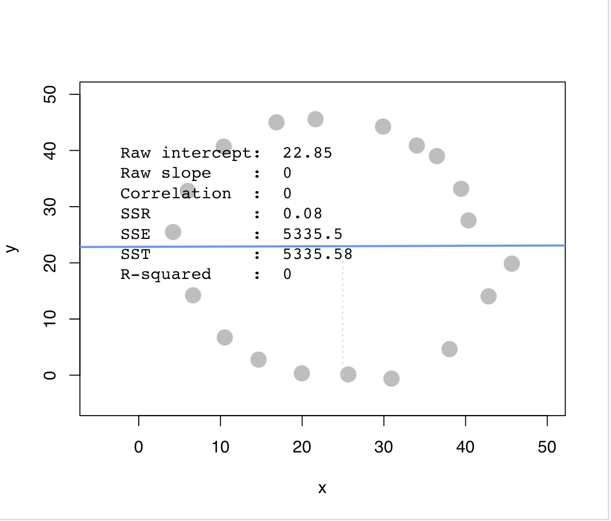
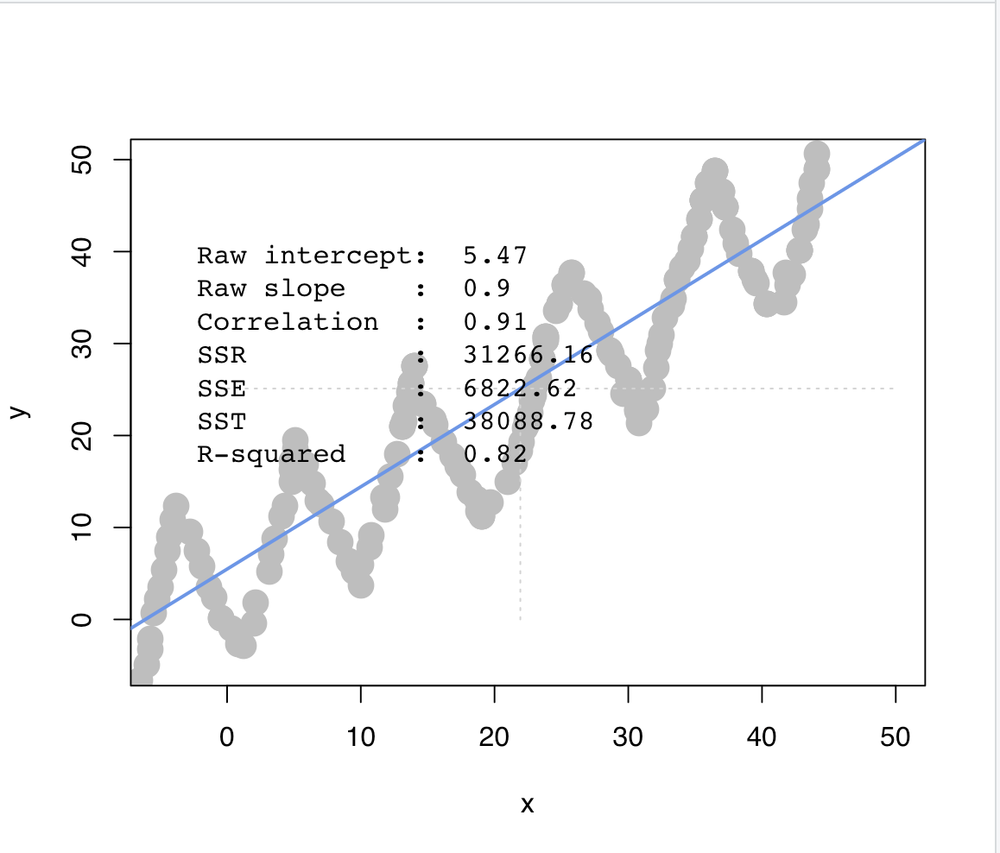
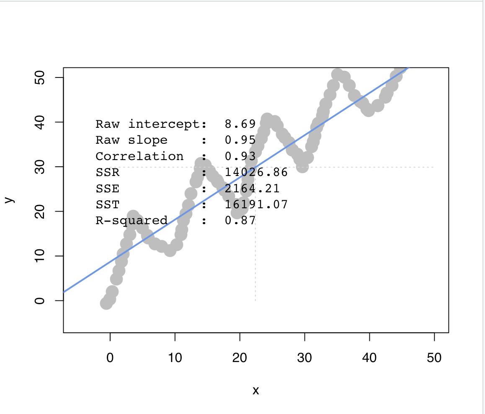

```{r setup, include=FALSE}
knitr::opts_chunk$set(echo = TRUE)
```

# Question 1) Let’s make an automated recommendation system for the PicCollage mobile app.

```{r}
library(data.table)
ac_bundles_dt <- fread("piccollage_accounts_bundles.csv")
ac_bundles_matrix <- as.matrix(ac_bundles_dt[, -1, with=FALSE])
```

## a. Let’s explore to see if any sticker bundles seem intuitively similar:

### (i) (recommended) Download PicCollage onto your mobile from the App Sto

There are a total of 60 different bundlies of stickers, categorized by themes such as style, situation, holiday, and recipient.

### (ii) Find a single sticker bundle that is both in our limited data set and also in the app’s Sticker Store  (e.g., “sweetmothersday”). Then, use your intuition to recommend (guess!) five other bundles in our dataset that might have similar usage patterns as this bundle.

Taking "sweetmothersday" as an example, other possible sticker bundles that may have similar usage patterns could be "Mother's Day Flowers", "Mother's Day Message", "Happy Mother's Day", "To All Mothers", and "Mom's Special Day", as these stickers are all related to Mother's Day theme and are likely to be recommended together.

## b. Let’s find similar bundles using geometric models of similarity:

### (i) Let’s create cosine similarity based recommendations for all bundles:

### 1. Create a matrix or data.frame of the top 5 recommendations for all bundles

```{r}
# install.packages("lsa")
library(lsa)
ac_bundles_matrix_cosmatrix <- as.data.frame(cosine(ac_bundles_matrix))
cosmatrix_rownames <- row.names(ac_bundles_matrix_cosmatrix)
top5_ac_bundles_cosmatrix <- as.data.frame(
  sapply(ac_bundles_matrix_cosmatrix, 
         FUN = function(x) 
           cosmatrix_rownames[order(x, decreasing = TRUE)[2:6]]))
```


### 2. Create a new function that automates the above functionality: it should take an accounts-bundles matrix as a parameter, and return a data object with the top 5 recommendations for each bundle in our data set, using cosine similarity.

```{r}
bundle_recommendation <- function(accounts_bundles_matrix){
  cosmatrix <- as.data.frame(cosine(accounts_bundles_matrix))
  cosmatrix_rownames <- row.names(cosmatrix)
  top5_bundle <- as.data.frame(
    sapply(cosmatrix, FUN = function(x) 
      cosmatrix_rownames[order(x, decreasing = TRUE)[2:6]]))
  return(top5_bundle)
}
```


### 3. What are the top 5 recommendations for the bundle you chose to explore earlier?


```{r}
recommendation <- bundle_recommendation(ac_bundles_matrix)
recommendation$sweetmothersday
```

### (ii) Let’s create correlation based recommendations.

### 1. Reuse the function you created above (don’t change it; don’t use the cor() function)

```{r}
bundle_recommendation <- function(accounts_bundles_matrix){
  cosmatrix <- as.data.frame(cosine(accounts_bundles_matrix))
  cosmatrix_rownames <- row.names(cosmatrix)
  top5_bundle <- as.data.frame(
    sapply(cosmatrix, FUN = function(x) 
      cosmatrix_rownames[order(x, decreasing = TRUE)[2:6]]))
  return(top5_bundle)
}
```

### 2. But this time give the function an accounts-bundles matrix where each bundle (column) has already been mean-centered in advance.

```{r}
bundle_means <- apply(ac_bundles_matrix, 2, mean)
bundle_means_matrix <- t(replicate(nrow(ac_bundles_matrix), bundle_means))
ac_bundles_mc_b <- ac_bundles_matrix - bundle_means_matrix
recommendation <- bundle_recommendation(ac_bundles_mc_b)
```

### 3. Now what are the top 5 recommendations for the bundle you chose to explore earlier?

```{r}
recommendation$sweetmothersday
```

### (iii) Let’s create adjusted-cosine based recommendations.

### 1. Reuse the function you created above (you should not have to change it)

```{r}
bundle_recommendation <- function(accounts_bundles_matrix){
  cosmatrix <- as.data.frame(cosine(accounts_bundles_matrix))
  cosmatrix_rownames <- row.names(cosmatrix)
  top5_bundle <- as.data.frame(
    sapply(cosmatrix, FUN = function(x) 
      cosmatrix_rownames[order(x, decreasing = TRUE)[2:6]]))
  return(top5_bundle)
}
```

### 2.  But this time give the function an accounts-bundles matrix where each account (row) has already been mean-centered in advance.

```{r}
account_means <- apply(ac_bundles_matrix, 1, mean)
account_means_matrix <- replicate(ncol(ac_bundles_matrix), account_means)
ac_account_mc_b <- ac_bundles_matrix - account_means_matrix
recommendation <- bundle_recommendation(ac_account_mc_b)
```

### 3. What are the top 5 recommendations for the bundle you chose to explore earlier?

```{r}
recommendation$sweetmothersday
```


## c. (not graded) Are the three sets of geometric recommendations similar in nature (theme/keywords) to the recommendations you picked earlier using your intuition alone? What reasons might explain why your computational geometric recommendation models produce different results from your intuition?

When using intuition alone, it may be assumed that people would pick similar themes based on their preferences when making purchases. However, after seeing the results of the recommendations, it became evident that some functional stickers, such as those related to Mother's Day, were not repeatedly purchased. These stickers only need to be purchased once, as different sets of stickers with similar themes achieve the same effect, and there is no need for repetitive purchases.

## d. (not graded) What do you think is the conceptual difference in cosine similarity, correlation, and adjusted-cosine?

# Question 2) Correlation is at the heart of many data analytic methods so let’s explore it further.

```{r}
library(compstatslib)
```

## a. Scenario A: Create a horizontal set of random points, with a relatively narrow but flat distribution.

### (i) What raw slope of x and y would you generally expect?

Since the overall trend of x and y appears to be horizontal, the expected slope would be 0.

### (ii) What is the correlation of x and y that you would generally expect?

Since the range of y values does not significantly change regardless of the variation in x values, remaining within a fixed range, it is expected that the correlation coefficient would be close to 0.

## b. Scenario B: Create a random set of points to fill the entire plotting area, along both x-axis and y-axis

### (i) What raw slope of x and y would you generally expect?

Each point is evenly distributed on the plot, so the expected mean would fall at the center of the plot and a horizontal line with a slope of 0 would be drawn.

### (ii) What is the correlation of x and y that you would generally expect?

As each point is evenly distributed on the plot, it is not clear to determine the relationship between x and y. Therefore, the correlation coefficient between x and y in this plot is assumed to be 0.

## c. Scenario C: Create a diagonal set of random points trending upwards at 45 degrees

### (i) What raw slope of the x and y would you generally expect? (note that x, y have the same scale)

The raw slope of x and y is generally expected to be 1, as x and y have the same scale and exhibit a positive 45-degree relationship.

### (ii) What is the correlation of x and y that you would generally expect?

The expected correlation coefficient between x and y would fall between -0.8 and -1, as they exhibit a strong positive correlation (i.e., as x increases, y decreases).

## d. Scenario D: Create a diagonal set of random trending downwards at 45 degrees

### (i) What raw slope of the x and y would you generally expect? (note that x, y have the same scale)
The expected raw slope of x and y would be -1, as they exhibit a negative 45-degree relationship.

### (ii) What is the correlation of x and y that you would generally expect?

The expected correlation coefficient between x and y would fall between -0.8 and -1, as they exhibit a strong negative correlation (i.e., as x increases, y decreases).

## e. Apart from any of the above scenarios, find another pattern of data points with no correlation (r $\sim$ 0). (can create a pattern that visually suggests a strong relationship but produces r $\sim$ 0?)


```{r, echo=FALSE, out.width="50%", fig.align="center"}

```


## f. Apart from any of the above scenarios, find another pattern of data points with perfect correlation (r $\sim$ 1). (can you find a scenario where the pattern visually suggests a different relationship?)

```{r, echo=FALSE, out.width="50%", fig.align="center"}

```

## g. Let’s see how correlation relates to simple regression, by simulating any linear relationship you wish:

### (i) Run the simulation and record the points you create: pts <- interactive_regression()  (simulate either a positive or negative relationship)

```{r}
# pts <- interactive_regression()
# write.table(pts, "pts.txt", sep = "\t", row.names = FALSE)
pts <- fread("pts.txt")
```

```{r, echo=FALSE, out.width="50%", fig.align="center"}

```

### (ii) Use the lm() function to estimate the regression intercept and slope of pts to ensure they are the same as the values reported in the simulation plot

```{r}
summary( lm( pts$y ~ pts$x ))
```

### (iii) Estimate the correlation of x and y to see it is the same as reported in the plot.

```{r}
cor(pts)
```


### (iv) Now, standardize the values of both x and y from pts and re-estimate the regression slope


```{r}
std_x <- (pts$x - mean(pts$x))/sd(pts$x)
std_y <- (pts$y - mean(pts$y))/sd(pts$y)

summary( lm( std_y ~ std_x ))
```

### (v) What is the relationship between correlation and the standardized simple-regression estimates?

Correlation coefficient and standardized simple regression estimates are very similar, as they can both be used to measure the strength and direction of a linear relationship between two variables.


