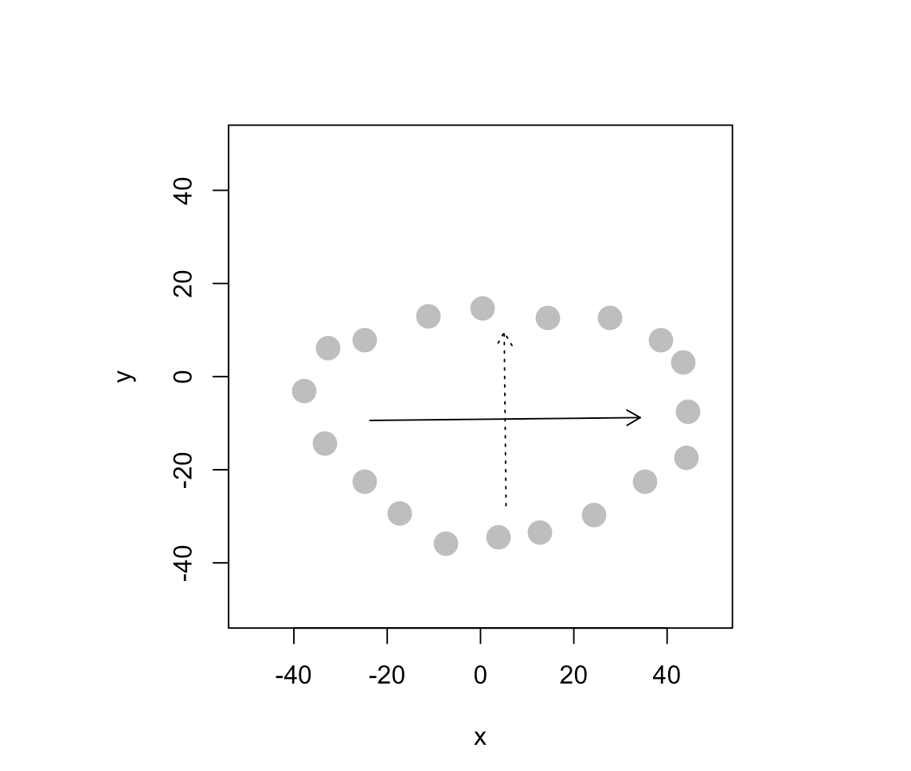
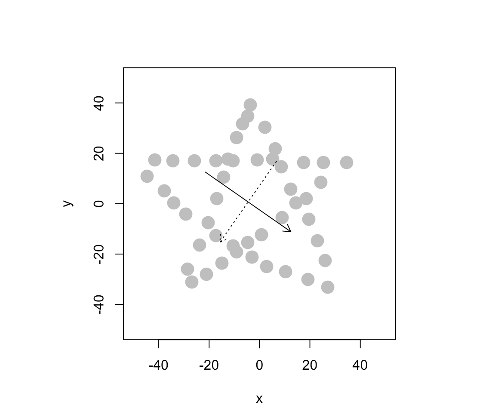

```{r setup, include=FALSE}
knitr::opts_chunk$set(echo = TRUE)
```

# Question 1) Let’s revisit the issue of multicollinearity of main effects (between cylinders, displacement, horsepower, and weight) we saw in the cars dataset, and try to apply principal components to it. Start by recreating the cars_log dataset, which log-transforms all variables except model year and origin. Important: remove any rows that have missing values.

```{r}
cars <- read.table("auto-data.txt", header=FALSE, na.strings = "?")
names(cars) <- c("mpg", "cylinders", "displacement", "horsepower", "weight", 
                 "acceleration", "model_year", "origin", "car_name")
cars <- na.omit(cars)
cars_log <- with(cars, data.frame(log(mpg), log(cylinders), log(displacement), 
                                  log(horsepower), log(weight), log(acceleration), 
                                  model_year, origin))
```

## a. Let’s analyze the principal components of the four collinear variables

### (i) Create a new data.frame of the four log-transformed variables with high multicollinearity

```{r}
round(cor(cars_log[, 2:8]), 2) # log.cylinders, log.displacement. , log.horsepower. , log.weight.  
cars_log_multicolline <- with(cars_log, 
                              data.frame(log.cylinders. , log.displacement. ,
                                         log.horsepower. , log.weight.))
```

### (ii) How much variance of the four variables is explained by their first principal component?

```{r}
cars_log_multicolline_eigen <- eigen(cov(cars_log_multicolline))
cars_log_multicolline_eigen$values[1]/sum(cars_log_multicolline_eigen$values)
cars_log_multicolline_pca <- prcomp(cars_log_multicolline)
summary(cars_log_multicolline_pca)$importance[2, 1]
```

### (iii) Looking at the values and valence (positiveness/negativeness) of the first principal component’s eigenvector, what would you call the information captured by this component?

```{r}
cars_log_multicolline_eigen$vectors
```

PC1 gets 72% information of log.displacement.

## b. Let’s revisit our regression analysis on cars_log:

### (i) Store the scores of the first principal component as a new column of cars_log

```{r}
scores = cars_log_multicolline_pca$x
cars_log$PC1 <- scores[, "PC1"]
```

### (ii) Regress mpg over the column with PC1 scores (replacing cylinders, displacement, horsepower, and weight), as well as acceleration, model_year and origin

```{r}
summary(lm(log.mpg.~ PC1 +log.acceleration.+model_year+factor(origin) , data=cars_log))
```

### (iii) Try running the regression again over the same independent variables, but this time with everything standardized. How important is this new column relative to other columns?

```{r}
cars_log_std <- data.frame(scale(cars_log))
summary(lm(log.mpg.~ PC1 +log.acceleration.+model_year+factor(origin) , data=cars_log_std))
cor(cars_log_std)[9, ]
```

# Question 2) Please download the Excel data file security_questions.xlsx from Canvas. In your analysis, you can either try to read the data sheet from the Excel file directly from R 

```{r, results = "hide"}
# install.packages("readxl")
library(readxl)
sec_q <- data.frame(read_excel("security_questions.xlsx", sheet = "data", col_names = T))
```

A group of researchers is studying how customers who shopped on e-commerce websites over the winter holiday season perceived the security of their most recently used e-commerce site. Based on feedback from experts, the company has created eighteen questions (see ‘questions’ tab of excel file) regarding security considerations at e-commerce websites. Over 400 customers responded to these questions (see ‘data’ tab of Excel file). The researchers now wants to use the results of these eighteen questions to reveal if there are some underlying dimensions of people’s perception of online security that effectively capture the variance of these eighteen questions. Let’s analyze the principal components of the eighteen items.

## a. How much variance did each extracted factor explain?

```{r}
sec_q_pca <- prcomp(sec_q, scale. = TRUE)
summary(sec_q_pca)$importance[2, ]
```

## b. How many dimensions would you retain, according to the two criteria we discussed?

```{r, out.width="50%", fig.align="center"}
sec_q_eigen <- eigen(cor(sec_q))
sec_q_eigen$values
screeplot(sec_q_pca, type="lines")
```

According to the criterion of Eigenvalue $\geq$ 1 and the Scree Plot, we can see that retaining 3 PCs is the best scenario. Increasing the number of PCs beyond 3 does not lead to a significant increase in the explained variance.

# Question 3) Let’s simulate how principal components behave interactively: run the interactive_pca() function from the compstatslib package we have used earlier:

## a. Create an oval shaped scatter plot of points that stretches in two directions – you should find that the principal component vectors point in the major and minor directions of variance (dispersion). Show this visualization.

```{r, echo=FALSE, out.width="50%", fig.align="center"}

```

## b. Can you create a scatterplot whose principal component vectors do NOT seem to match the major directions of variance? Show this visualization.

```{r, echo=FALSE, out.width="50%", fig.align="center"}

```


